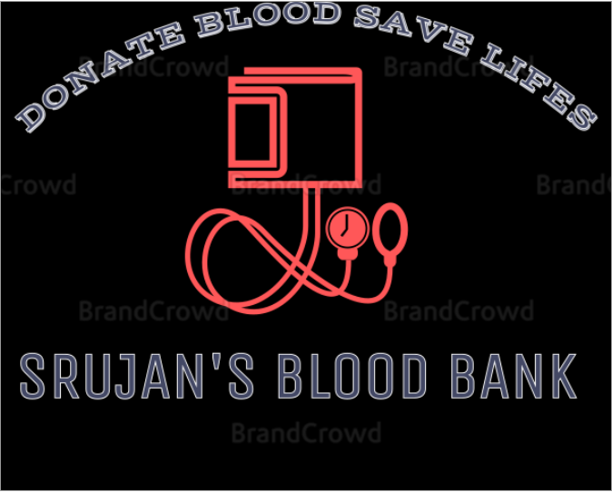

# blood_bank_app
This is Basicaly a SOFTWARE ENGINEERING PROJECT.
I have used FIREBASE for the DATABASE and JAVA as programing language.

# LOGO:

# Login Page:

# Menu Page:

# Donor Info:

# Check Donor:

# Bloodbank Info:

# srujanbannu/blood_bank_app is licensed under the
## Mozilla Public License 2.0
