# blood_bank_app
This is BLOOD BANK APP where I and SAI GOAPAL have created. Here I will be working as an admin. I have used GOOGLE signIn as my login(API). 
After login you can find several opitions.I have attached all the working images of it bellow. In the DONOR panel, people who are ready to donate they can fill the details. I made this as a prototype,So I have kept few districts only. Then it comes to the REQUEST panel. Here the person in need will send request to the pertical blood group and the request is raised. Me in admin panel will confirm with the actual person before giving the details to the customer. I will change the status in the DATABASE(FIREBASE). Then they can check with the status bar given in the request panel. In Database "T" refers to Accepted, "F" refers to pending and "R" refers to reject.

I have used FIREBASE for the DATABASE, Android Studios as platform and JAVA as programing language, Xml for front end.

# Login Page:
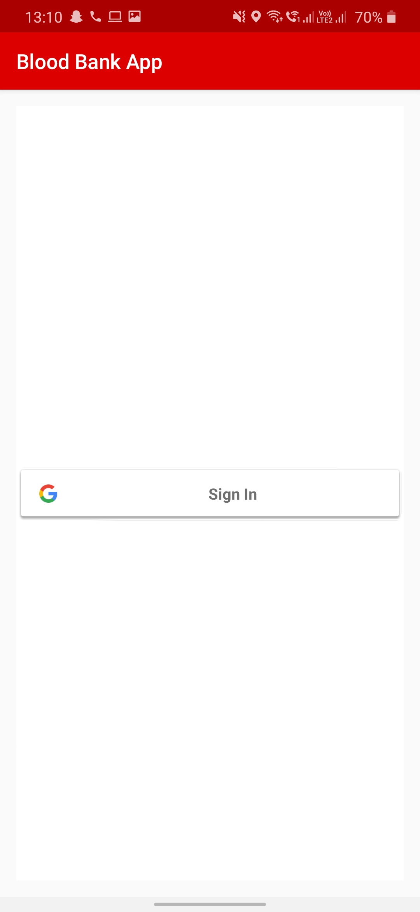

# Menu Page:
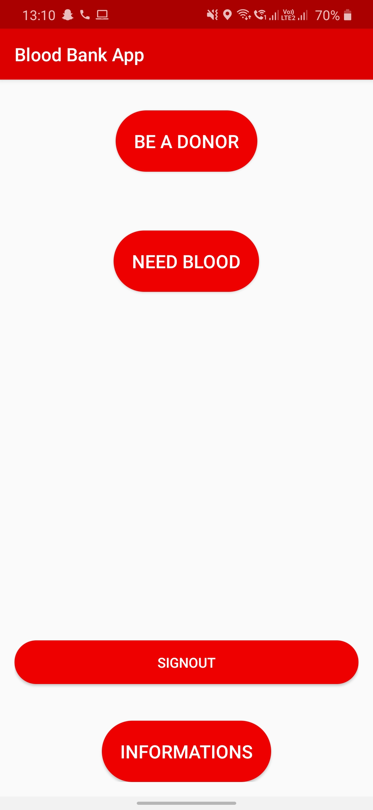

# Donor Info:
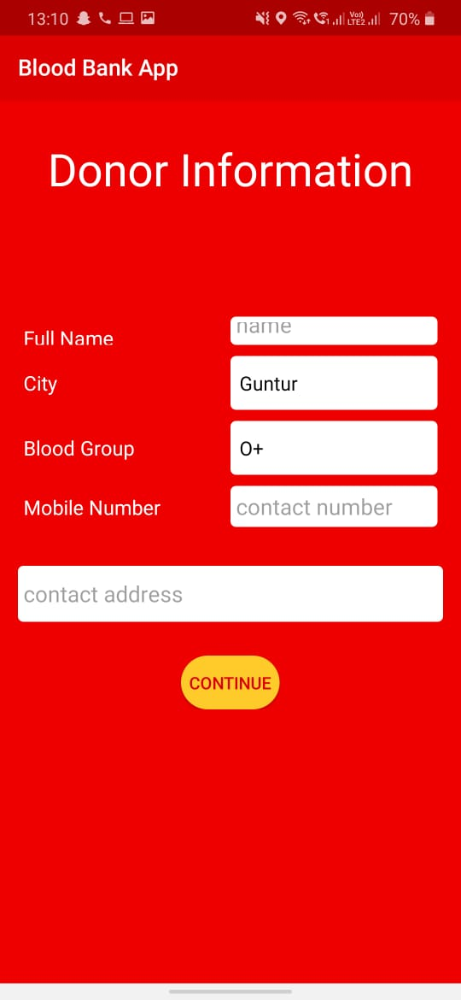

# Check Donor:
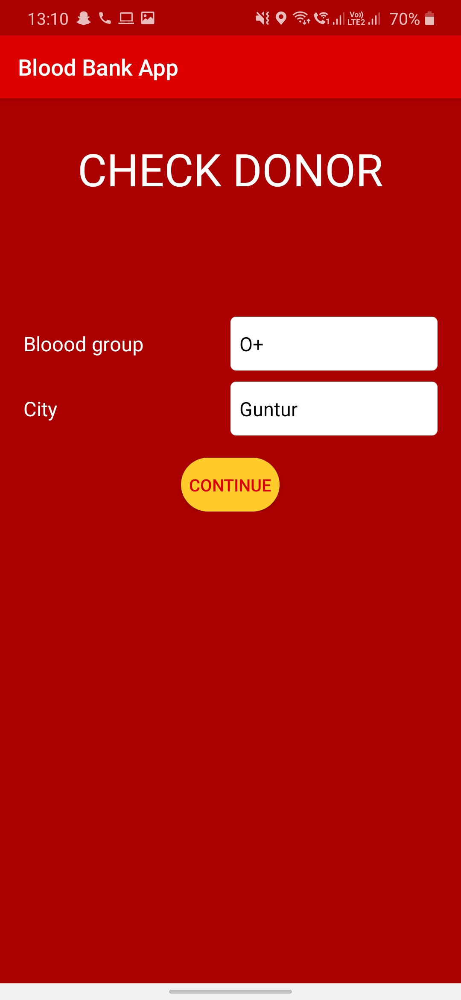

# List of donors in that selected area and blood group:
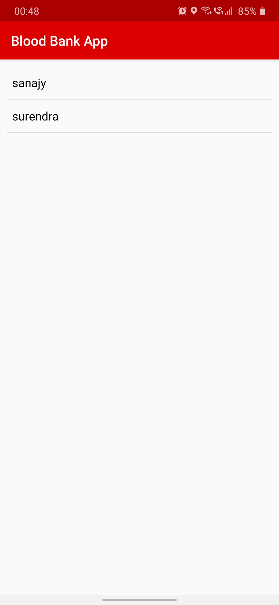

# Pressing on the feild we require:
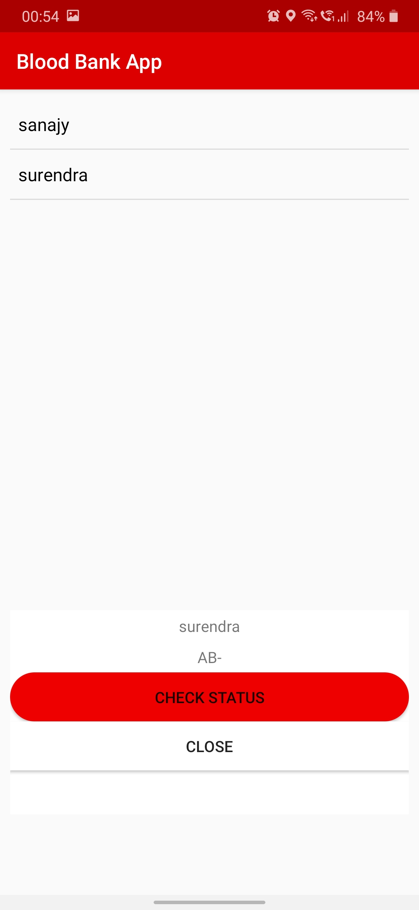

# After sending request  & in data base I have kept R :

# DATABASE == FIREBASE :
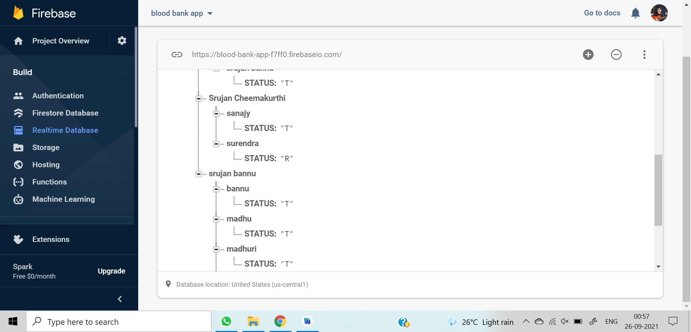

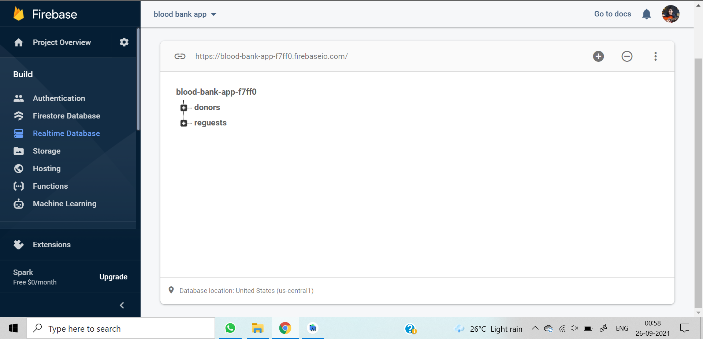

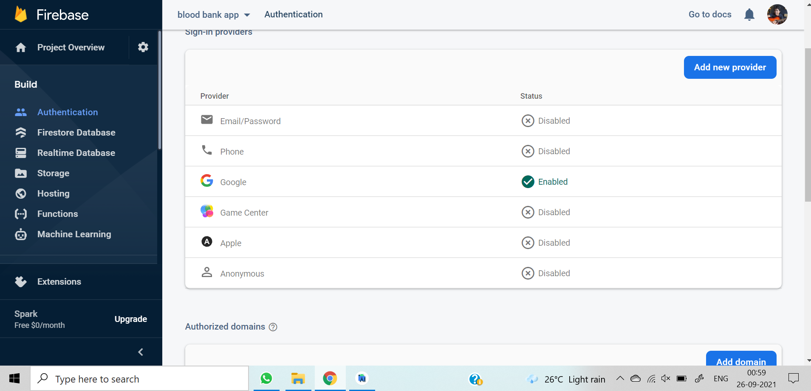

# Images of pending request and accepted request:
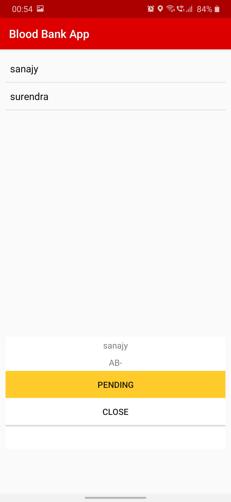

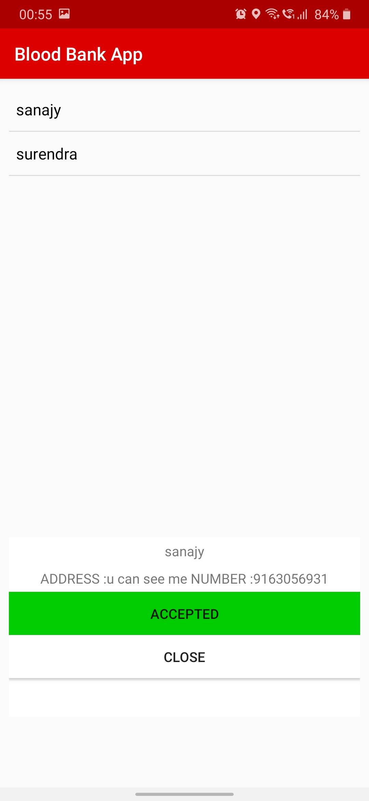

# Bloodbank Info:
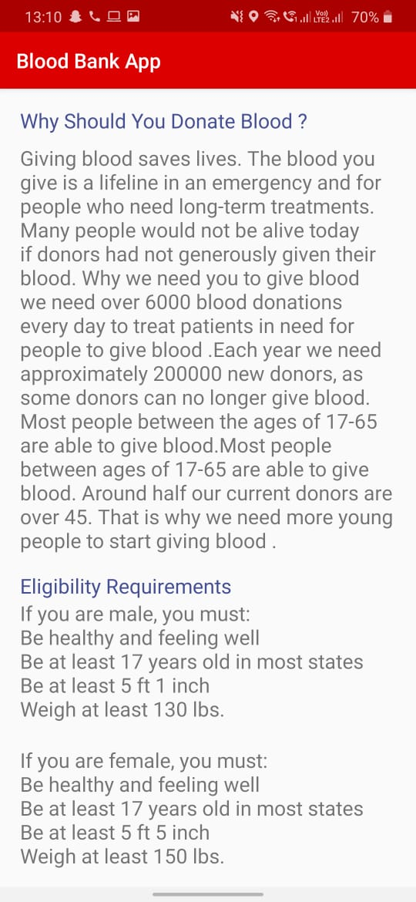

# srujanbannu/blood_bank_app is licensed under the
## Mozilla Public License 2.0
